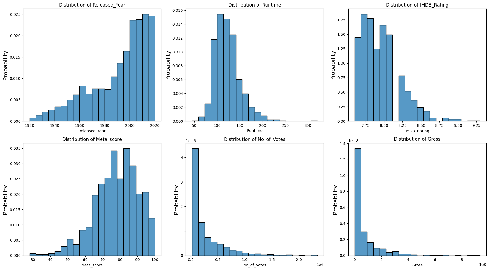
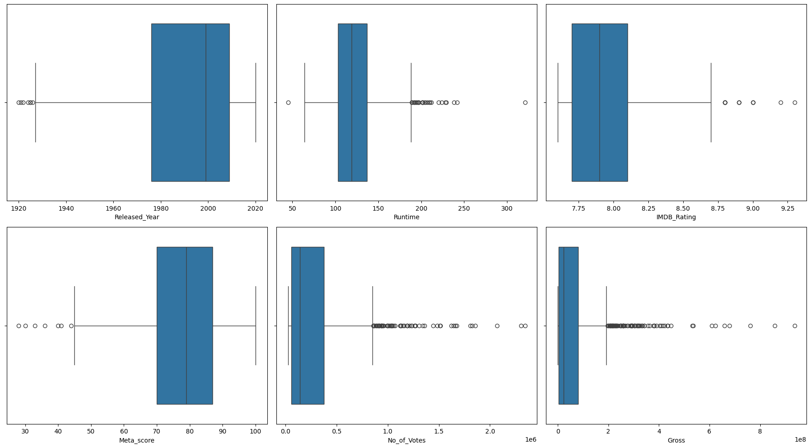
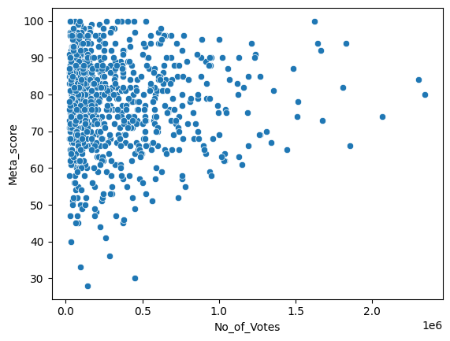
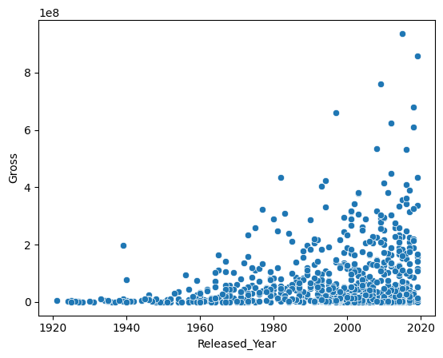
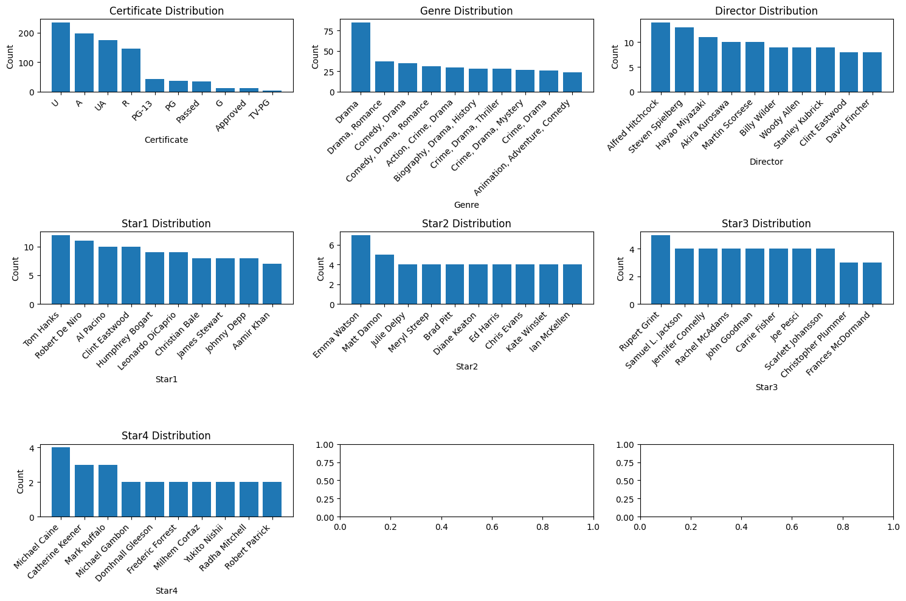
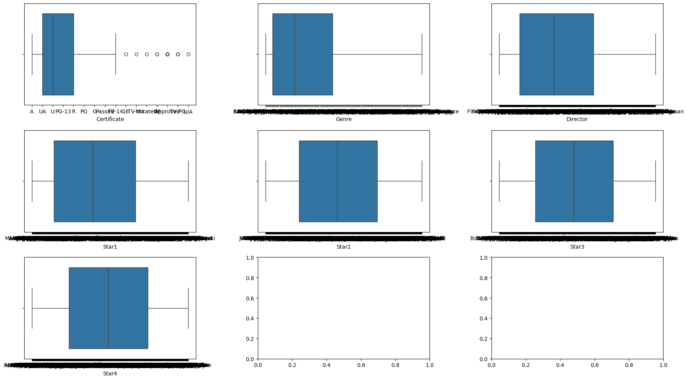

# Descriptive Data Analysis – IMDB Top 1000 Movies

This project performs exploratory data analysis (EDA) and descriptive statistics on the IMDB Top 1000 movies dataset. All steps—data cleaning, missing value handling, outlier detection, and visualization—are implemented from scratch using Python data analysis libraries.

## Project Overview

- **Dataset**: IMDB Top 1000 Movies
- **Goal**: Understand data patterns, distributions, and relationships through descriptive statistics and visualizations
- **Key Columns**: Release Year, Runtime, IMDB Rating, Meta Score, Votes, Gross Revenue, Certificate, Genre, Director, Stars

## Data Cleaning

### Missing Values
Columns with missing values detected:
- `Certificate` (217 missing)
- `Meta_score` (216 missing)
- `Gross` (210 missing)

### Data Types
All numeric columns properly formatted:
- `Gross` (revenue in USD) stored as string → needs conversion
- Categorical columns (`Certificate`, `Genre`, `Director`, `Stars`) kept as is

## Descriptive Findings

| Metric | Insight |
|--------|---------|
| **Mean vs Median** | Gross has highest difference (skewed distribution) |
| **Year Range** | 1920–2020 (most movies from recent years, peak 2014) |
| **Most Popular Genre** | Drama |
| **Rating Distribution** | Generally high ratings (top 1000 dataset bias) |

## Outlier Analysis

Outliers were detected but **NOT removed** because they represent real, meaningful data:

- **Gross Revenue**: Some movies are blockbuster hits (valuable information)
- **Runtime**: Very short or long movies are rare but legitimate
- **IMDB Rating**: Very few movies score above 9 (these are important)
- **Votes**: Some movies have millions of votes (worldwide hits)

> **Decision**: Keep all outliers as they provide insights into exceptional movies.

### Outlier Count by Column
| Column | Outlier Count |
|--------|---------------|
| Gross | Highest |
| Votes | High |
| Runtime | Low |
| IMDB Rating | Low |
| Meta Score | Low |

## Visualizations & Interpretations

### Histograms (Distribution)
| Column | Key Finding |
|--------|-------------|
| **Year** | More movies in recent years (cinema growth) |
| **Runtime** | Symmetric, mostly 100–150 minutes |
| **IMDB Rating** | Mostly 7.5–8.5, few above 9 |
| **Meta Score** | Mostly 70–90 (critically acclaimed movies) |
| **Votes** | Highly skewed left (few movies with millions of votes) |
| **Gross** | Highly skewed (few blockbusters, most have similar revenue) |

### Box Plots (Outlier Visualization)
- **Year**: Classic movies (1920s–1950s) appear as outliers
- **Runtime**: Few very long movies (still reasonable)
- **IMDB Rating**: Only a handful above 8.75
- **Meta Score**: Some movies with low critic scores
- **Votes & Gross**: Many outliers on the high end (successful movies)

### Scatter Plots (Relationships)

| Relationship | Finding |
|--------------|---------|
| **Gross vs IMDB Rating** | No direct correlation (high rating ≠ high revenue) |
| **Votes vs IMDB Rating** | Positive correlation (more votes → higher rating) |
| **Gross vs Year** | Increasing trend in last 20 years |
| **Votes vs Meta Score** | Interesting 4-quadrant pattern: |
| | • Top-right: Loved by both public & critics (rare) |
| | • Top-left: Critically acclaimed, less popular |
| | • Middle: Popular with public, lower critic scores |

### Bar Charts (Categorical)
| Category | Top Values |
|----------|-------------|
| **Certificate** | U, A, UA, R (all ages to adults) |
| **Genre** | Drama, Romance, Comedy |
| **Director** | Well-known, popular directors |
| **Stars** | Famous actors (recognizable names) |

### Box Plot for Certificate
- Some certificates appear less frequently (real data, not errors)
- Kept unchanged (no removal)

## Key Data Patterns & Conclusions

1. **High Rating Bias**: Dataset contains top 1000 IMDB movies → ratings are naturally high with low variance

2. **Popularity Indicators**: Drama, Romance, Comedy genres + famous directors/stars appear most frequently

3. **Rating ≠ Revenue**: No direct relationship between IMDB rating and box office success
   - Some low-rated movies are commercially successful
   - Critical acclaim doesn't guarantee public popularity

4. **Market Growth**: Overall revenue has increased in the last two decades

5. **Critics vs Public**: 
   - Critically acclaimed movies aren't always popular with masses
   - Popular movies don't always have high critic scores
   - Movies loved by both are extremely rare

## Future Work

- Handle missing values (based on distribution characteristics)
- Apply rescaling/normalization if needed for modeling
- Perform predictive analysis (e.g., revenue prediction)

## Files

- `dataset_descriptive_analysis.pdf` – Full project report (in Farsi)
- `README.md` – This file

## Requirements

- Python 3.x
- Pandas
- NumPy
- Matplotlib
- Seaborn